<p align="center">
  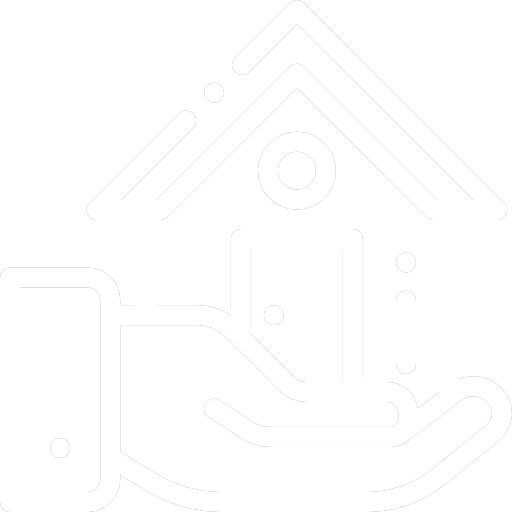
  <br>
</p>
<h3 align="center">
Seu novo lar está aqui!
</h3>

<p align="center">
  
  
  
  
</p>

<p align="center">
  <a href="#sobre">Sobre</a> •
  <a href="#imobi">Imobi</a> •
  <a href="#instalação">Instalação</a> •
  <a href="#tecnologias">Tecnologias</a> •
  <a href="#autor">Autor</a>  
</p>

## Sobre

Projeto desenvolvido durante a Pystack week 2.0 cujo objetivo foi criar uma aplicação com o framework Django.

## Imobi

O Imobi é uma aplicação imobiliária cujo objetivo é dar visibilidade para imoveis à venda e proporcionar um ambiente centralizado para interessados realizarem agendamentos de visitas aos imoveis.

Ao acessar a aplicação pela primeira vez o usuário deve realizar seu cadastro através da tela abaixo:

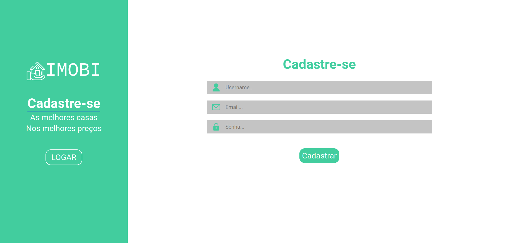

Feito isso, basta realizar o login na plataforma para acessar os detalhes dos imoveis cadastrados. Ao criar a conta o usuário será direcionado para a tela de login automaticamente, aonde deverá informar seus dados de acesso, caso alguma informação esteja incorreta o formulário irá dar o feedback para o usuário conforme mostrado abaixo:

|            Tela de login            |     Tela de login - Preenchimento incorreto      |
| :---------------------------------: | :----------------------------------------------: |
| 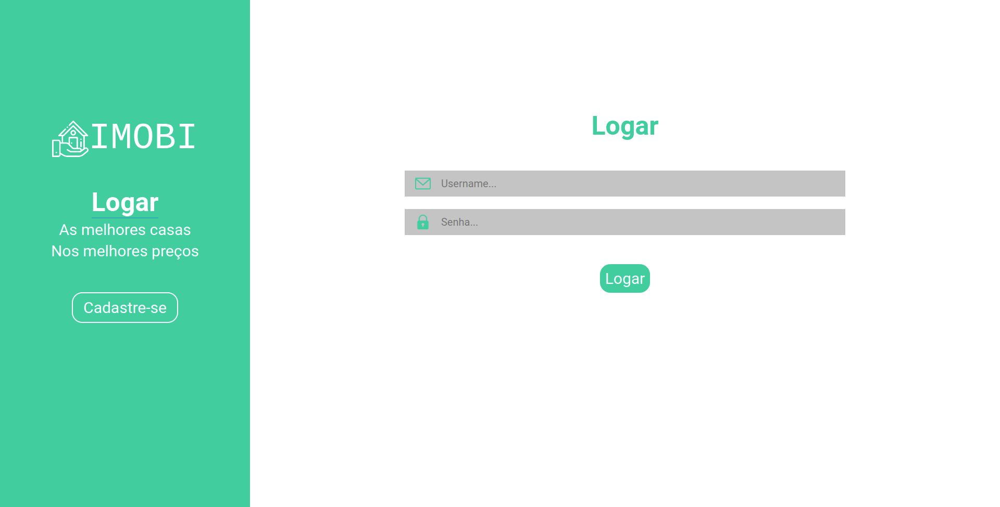 | 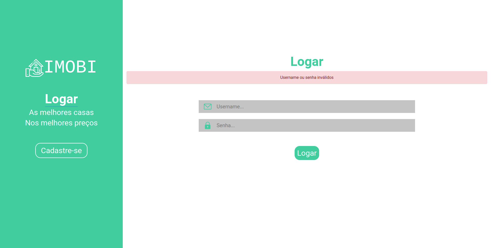 |

Após o login com os dados correto, o usuário terá acesso a homepage da aplicação, aonde inicialmente serão exibidos os imoveis disponíveis e uma opção para filtrar os resultados, conforme imagem a seguir:

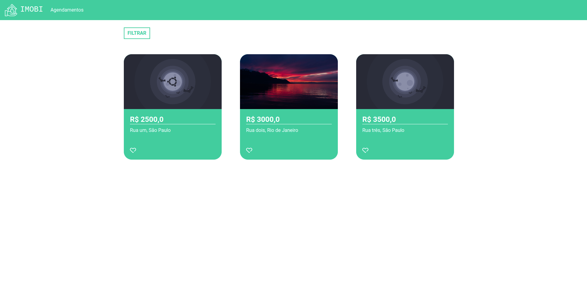

Modal de filtros disponível na homepage:

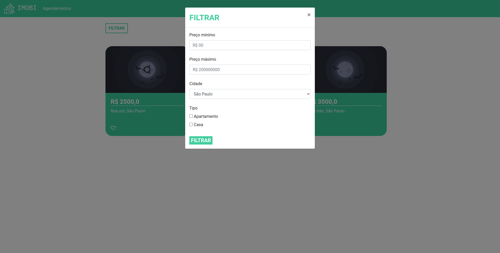

Ao clicar em um imóvel de interesse, os seus detalhes serão exibidos na tela abaixo, tais como: imagens, descrição e endereço, assim como um botão para realizar o agendamento de uma visita e imoveis semelhantes ao visualizado.

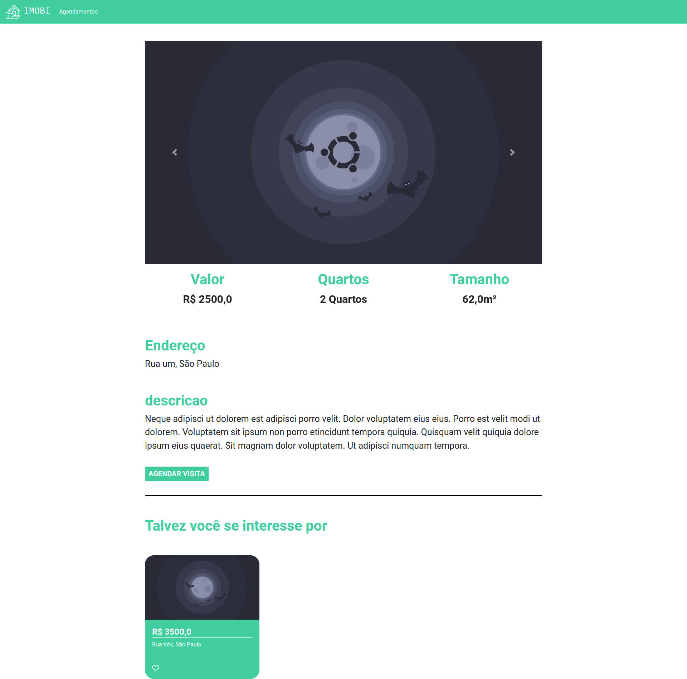

Ao clicar no botão `Agendar visita` presente na pagina de detalhes do imóvel, o modal de agendamentos será aberto para o usuário escolher a data e horário de sua preferencia:

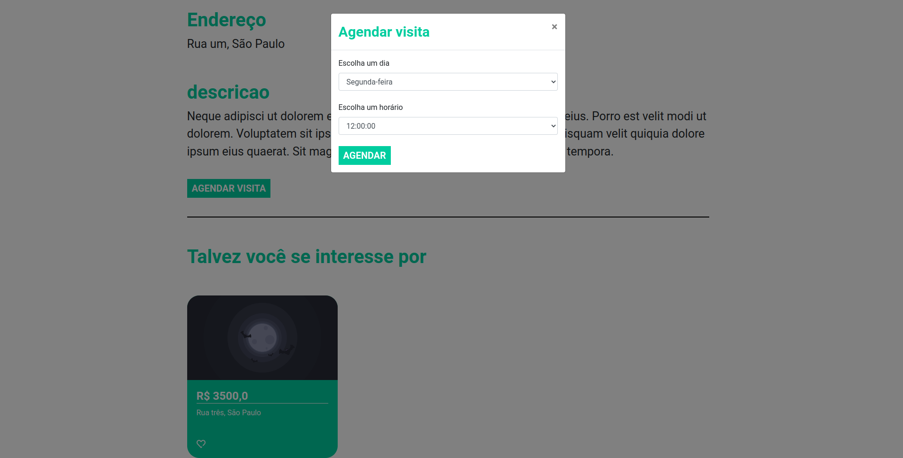

Após concluir o agendamento (também acessível através do link `Agendamentos` presente no header da página) o usuário poderá ver seus agendamentos cadastrados e seus respectivos status, como exemplificado abaixo:

- **Agendamento Concluído**: Representa um agendamento realizado com sucesso.

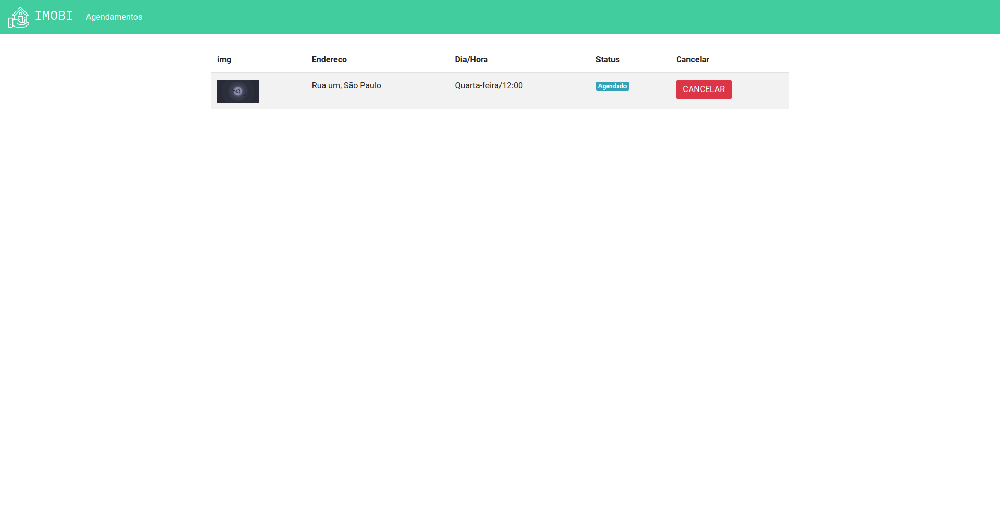

- **Agendamento Finalizado**: Representa um agendamento cujo a visita já ocorreu.

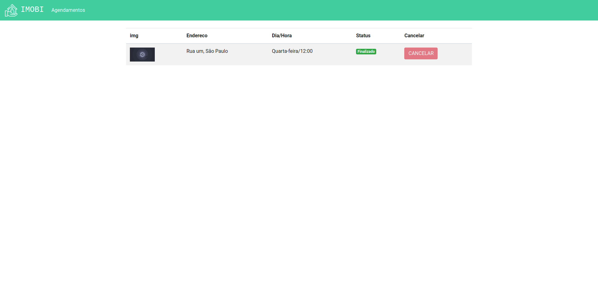

- **Agendamento Cancelado**: Representa um agendamento cancelado pelo usuário.

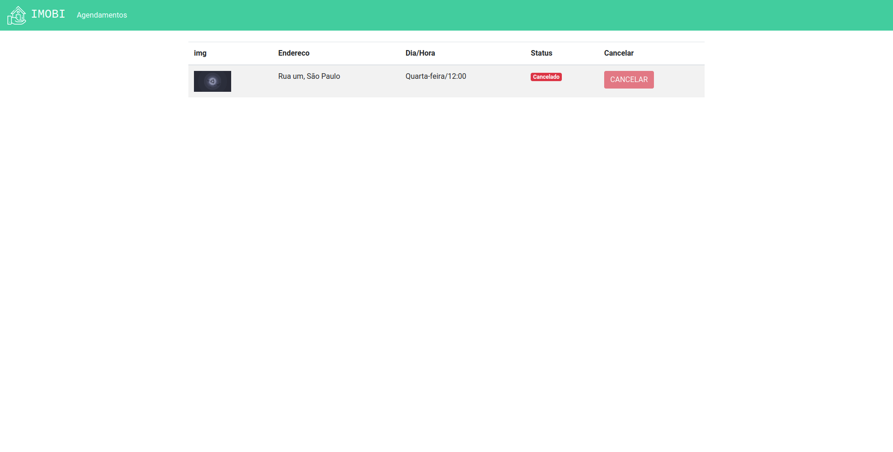

Com isso concluo a explicação sobre o projeto. Por razões de demonstração, deixo abaixo um GIF aonde navegado pelas interfaces explicadas acima e passo por todos os fluxos do app:


## Instalação

Antes de começar, você vai precisar ter instalado em sua máquina as seguintes ferramentas:
[Git](https://git-scm.com), [Python](https://www.python.org/). Além disso é bom ter um editor para trabalhar com o código como [VSCode](https://code.visualstudio.com/).

### 🖥 Rodando o projeto

```bash
# Clone este repositório
$ git clone git@github.com:MrRioja/pythonando-imobi.git

# Acesse a pasta do projeto no terminal/cmd
$ cd pythonando-imobi

# Ative o ambiente virtual
$ source venv/bin/activate

# Execute a aplicação em modo de desenvolvimento
$ python3 manage.py runserver

# O servidor iniciará na porta 8000 - acesse <http://localhost:8000>
```

## Tecnologias


<br><br><br>

## Autor

<div align="center">

<h1>Luiz Rioja</h1>
<strong>Backend Developer</strong>
<br/>
<br/>

<a href="https://linkedin.com/in/luizrioja" target="_blank">

</a>

<a href="https://github.com/mrrioja" target="_blank">

</a>

<a href="mailto:lulyrioja@gmail.com?subject=Fala%20Dev" target="_blank">

</a>

<a href="https://api.whatsapp.com/send?phone=5511933572652" target="_blank">

</a>

<a href="https://join.skype.com/invite/tvBbOq03j5Uu" target="_blank">

</a>

<br/>
<br/>
</div>
